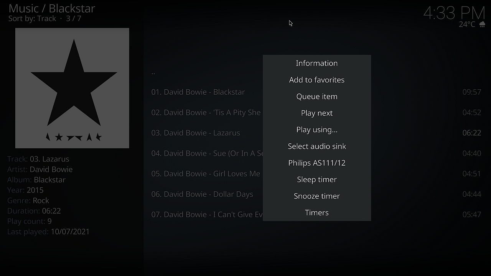

# kodi-addon-pasink

_Kodi addon in order to set Pulse-Audio sinks with bluez and combined-sink support_

I have written this KODI plugin in order to make it as easy as possible to switch between audio sinks. In addition I wanted to combine a local wired sink with a bluetooth audio device (A2DP).

This plugin is based on my project [pasink](https://github.com/Heckie75/pasink) 


## Requirements / pre-conditions


This plugin calls the command `pasink`. pasink interally uses the following:

1. `bluez` - Bluetooth tools and daemons, especially the command `bluetoothctl`

The script uses `bluetoothctl` in order to list already paired A2DP bluetooth devides and to connect to them by name or mac address. 

2. `expect`

Internally pasink remote controls `bluetoothctl` like a macro. This will be done by using `expect`
`expect` can be installed as follows:

```
$ sudo apt install expect
```

3. `pulseaudio`

Pulse-Audio is the audio server. It should come with any state-of-the-art linux distribution out of the box. You might want to check if the following command line tools are available which are called by `pasink` internally:

a) `pacmd`

b) `pactl`

You have maybe to check and adjust some configuration. Please make sure that the following line is in the file `/etc/pulse/default.pa`:

```
load-module module-switch-on-connect
```

I guess that this module is required because it is responsible to automatically setup a new audio sink after a bluetooth A2DP device has been connected.  


4. GNU Awk

Please check if GNU Awk (`gawk`) is installed.

```
$ awk --version
GNU Awk 4.2.1, API: 2.0 (GNU MPFR 4.0.2, GNU MP 6.1.2)
```

## Install kodi plugin / addon

Download the archive file, e.g. _script.pasink.2.0.1.zip_, and install the addon by using this archive file. Since this is not an offical Kodi addon it isn't available in Kodi's addon repositories.

After you have installed the addon you must activate the plugin explicitly and maybe restart Kodi.
1. Start Kodi
2. Go to "Addons" menu
3. Select "User addons"
4. Select "All addons", select "Pulse-Audio Sink Setter" and activate it

## Howto

After you have installed and activated the plugin, there is a new tile in the KODI's addon menu. It is a program addon. In addition this addon adds an entry in the context menu called 'Select audio sink' so that the addon is reachable with just a few clicks. 



### Overview

After you have clicked on "Pulse-Audio Sink Setter" the plugin is going to detect your audio devices (ALSA cards) and already paired bluetooth A2DP devices. This can also be done in _addon's setttings dialog_.

**Note:** The plugin doesn't come with pairing capabilities. You must pair your bluetooth audio devices by yourself. 

Afterwards you will see a list like this:


The pre-selected entry is the default sink which is the sink that is active at this moment.

The first step is to choose the new sink. Then you can decide if you just want to select this single sink or to combine it with another sink:


It is not possible to combine a sink with itself or with an already combined sink. In addition you can't combine two bluetooth sinks. That's the reason why there are less options in this dialog:


After you have confirmed the dialog there is a status message in the upper right corner after the sinks have been changed. 


### Aliases
As you have seen there are pretty names for ALSA and bluetooth devices. These _aliases_ can be configured in the settings dialogs like this:


**Note:** Aliases don't work for simultanious devices (combined sinks) yet. 